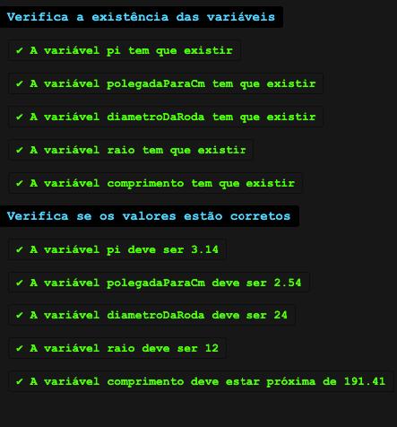

# ✅ Exercício 1-1


Se você não fizer os exercícios, será impossível aprender JavaScript.


## Hora da prática!

Nos exercícios você irá utilizar a mesma plataforma onde testou código até então, chamada _Coolfee_. Essa plataforma permite _codar_ (escrever o código) e executar os _testes unitários_, que são como se fossem um avaliador, que diz se você passou em todos os requisitos do código ou não, e onde falhou.

Veja abaixo como os resultados do teste aprovado se apresentam:

<figure><figcaption>
Exemplo de teste aprovado
</figcaption></figure>

E assim é como os resultados do teste que falhou se apresentam:

<figure><figcaption>
Exemplo de teste reprovado
</figcaption></figure>

### <mark style="color:yellow;">\[A] Tamanho do círculo</mark>

Agora você tem a sua primeira missão da trilha, e será de criar variáveis! Nesse exercício você vai fazer cálculos sobre o tamanho de um círculo. O comprimento de um círculo é calculado através da fórmula <mark style="color:orange;">`2 * pi * raio`</mark>.

1. Crie uma variável chamada exatamente `pi` que recebe o valor `3.14` ;
2. Crie uma variável chamada exatamente `polegadaParaCm` com o valor numérico `2.54` que será utilizada para converter polegadas para cm através da multiplicação desse valor;
3. Crie uma variável chamada exatamente `diametroDaRoda` com o valor numérico `24`; Esse valor está ainda em polegadas;
4. Crie uma variável chamada `raio`, que vai receber `diametroDaRoda / 2`;
5. Crie a variável `comprimento`, que vai receber `2 * pi * raio * polegadaParaCm`.\
   Essa é a fórmula para calcular o comprimento do círculo e depois convertê-lo para centímetros.

Clique [aqui](https://esta.la/Mj7) para abrir o editor de código e fazer esse exercício! Ao clicar em `Run` o seu código será avaliado. Caso exista algum erro de código, o erro será exibido em vez do resultado do teste.

Clique [aqui](https://esta.la/V13) para ver o **gabarito** desse exercício.
