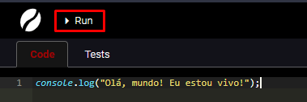

# 🌎 Olá, mundo! (console.log)


**Racional**: a vantagem de você saber como exibir informações de registro é poder analisar como o código está funcionando; e nesse momento utilizaremos isso para realizar operações básicas de modo que possamos entender como o JavaScript opera, nessa e nas próximas lições.


Um método muito utilizado e que serve justamente para exibir um dado ou informação é o `console.log`. Seu significado é: _console_ é onde vamos mostrar a informação e _log_ é do inglês _registro,_ já que o comando serve para fazer um registro temporário de informações na tela. Veja um exemplo de uso:


```javascript
console.log("Olá, mundo! Eu estou vivo!");
```


O comando acima tem como resultado exibir a frase  [<mark style="background-color:green;">Olá, mundo! Eu estou vivo!</mark> ](#user-content-fn-1)[^1] para o usuário.\
Siga [esse link](https://coolfee.github.io/#\{%22autorun%22:%221%22,%22code%22:%22console.log\(\\%22Ol%C3%A1,%20mundo!%20Eu%20estou%20vivo!\\%22\);%22,%22tests%22:%22;%22}) para ver esse código executando no navegador.


**Para experimentar**: Uma vez na plataforma de código, altere o conteúdo da mensagem e clique no botão _Run (ctrl/cmd + s)_ para ver que o texto exibido à direita se modifica.




O _log_ é uma forma rudimentar de conversar com o usuário, e abre um mundo enorme de coisas que você pode experimentar. Como você faria por exemplo para mostrar números em vez de texto? Podemos colocar números dentro das aspas? Que diferença faz dentro e fora das aspas? Você vai ver isso nas próximas lições.

[^1]: Importante: veja que as aspas fazem parte da forma de escrever um texto que não é um comando, mas um texto literalmente dizendo. Por isso, as aspas não aparecem na tela.
