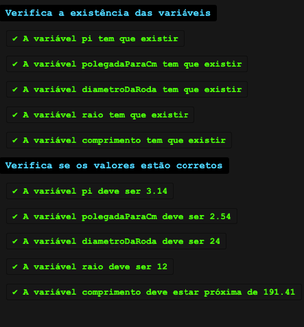

# 🧪 Operações com variáveis

**Vantagem:** como as variáveis podem ser reutilizadas, é muito conveniente para reaproveitamento de código e repetição de operações.

Anteriormente você viu que pode estabelecer dados em _string_ para as variáveis. Mas também consegue fazer isso com números e utilizá-los nos cálculos.\
O exemplo de código abaixo exibe o tempo que o carro de Lucas levaria para percorrer distâncias variadas com uma velocidade fixa, armazenada na variável `velocidade`.


Dica: como o código abaixo inicia com uma _string_, o operador + seria entendido como concatenação, não é? **Não**. Aqui, como há uma **divisão**, e a divisão ocorre antes da soma pela regra da precedência matemática, esse problema está resolvido automaticamente no entendimento do JavaScript.\
**No entanto, para aumentar a nitidez das operações, a conta foi colocada entre parênteses, que seria a solução caso a conta fosse de soma.**


```javascript
let velocidade = 80;
let nome = "Lucas";
console.log("O carro de " + nome + " percorreria 80Km em " + (80 / velocidade) + "h");
console.log("O carro de " + nome + " percorreria 180Km em " + (180 / velocidade) + "h");
console.log("O carro de " + nome + " percorreria 1745Km em " + (1745 / velocidade) + "h");
```


Siga [este link](https://esta.la/e3Y) para acessar o código acima_._


Veja que a reutilização da variável permite que você troque a velocidade do carro de Lucas apenas uma vez no código, na linha 1, alterando o resultado de todos os `console.log` de uma vez só.

Você pode também criar variáveis baseando-se em outras, o que simplifica o código e com isso realizar coisas mais complexas:

```javascript
let velocidade = 80;
let nome = "Lucas";
let tempo80 = 80 / velocidade;
let tempo180 = 180 / velocidade;
let tempo1745 = 1745 / velocidade;
console.log("Lucas percorreria 80km em " + tempo80 + "h");
console.log("Lucas percorreria 180km em " + tempo180 + "h");
console.log("Lucas percorreria 1745km em " + tempo1745 + "h");
```


Siga [este link](https://esta.la/765) para acessar o código acima_._


## Hora da prática!

Agora você tem a sua primeira missão, e será de criar variáveis! Nesse exercício faremos cálculos sobre o tamanho de um círculo. O comprimento de um círculo é calculado através da fórmula <mark style="color:orange;">`2 * pi * raio`</mark>.

1. Crie uma variável chamada exatamente `pi` que recebe o valor `3.14` ;
2. Crie uma variável chamada exatamente `polegadaParaCm` com o valor numérico `2.54` que será utilizada para converter polegadas para cm através da multiplicação desse valor;
3. Crie uma variável chamada exatamente `diametroDaRoda` com o valor numérico `24`; Esse valor está ainda em polegadas.
4. Crie uma variável chamada `raio`, que vai receber `diametroDaRoda / 2`;
5. Crie uma variável chamada `comprimento`, que vai receber `2 * pi * raio * polegadaParaCm`. Essa é a fórmula para calcular o cumprimento do círculo e depois convertê-lo para centímetros.

Clique [aqui](https://esta.la/jMV) para abrir o editor de código e fazer esse exercício! Ao clicar em `Run` o seu código será avaliado. Caso exista algum erro de código, o erro será exibido em vez do resultado do teste. Ao fim dessa lição você encontra o gabarito.

Veja abaixo como os resultados do teste se apresentam:

<figure><figcaption><p>Exemplo de teste aprovado</p></figcaption></figure>

<figure><figcaption><p>Exemplo de teste reprovado</p></figcaption></figure>

Clique [aqui](https://esta.la/D49) para ver o **gabarito** desse exercício.
